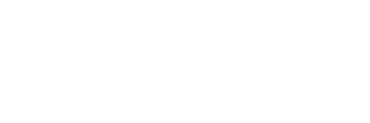

# Temporal Message Alignment

Robots have multiple sensors emitting data at different rates and latencies. A camera might run at 30fps, while lidar scans at 10Hz, and each has different processing delays. For perception tasks like projecting 2D detections into 3D pointclouds, we need to match data from these streams by timestamp.

`align_timestamped` solves this by buffering messages and matching them within a time tolerance.

<details>
<summary>diagram source</summary>

```pikchr fold output=assets/alignment_overview.svg
color = white
fill = none

Cam: box "Camera" "30 fps" rad 5px fit wid 170% ht 170%
arrow from Cam.e right 0.4in then down 0.35in then right 0.4in
Align: box "align_timestamped" rad 5px fit wid 170% ht 170%

Lidar: box "Lidar" "10 Hz" rad 5px fit wid 170% ht 170% with .s at (Cam.s.x, Cam.s.y - 0.7in)
arrow from Lidar.e right 0.4in then up 0.35in then right 0.4in

arrow from Align.e right 0.4in
Out: box "(image, pointcloud)" rad 5px fit wid 170% ht 170%
```

<!--Result:-->


</details>

## Basic Usage

```python session=align
from reactivex import Subject
from dimos.types.timestamped import Timestamped, align_timestamped

# Create streams
camera = Subject()
lidar = Subject()

# Align camera frames with lidar scans
# match_tolerance: max time difference for a match (seconds)
# buffer_size: how long to keep messages waiting for matches (seconds)
aligned = align_timestamped(
    camera,
    lidar,
    match_tolerance=0.1,
    buffer_size=2.0,
)

results = []
aligned.subscribe(lambda pair: results.append(pair))

# Helper to create timestamped messages
class Msg(Timestamped):
    def __init__(self, ts: float, data: str):
        super().__init__(ts)
        self.data = data

# Emit some data
camera.on_next(Msg(1.0, "frame_1"))
camera.on_next(Msg(2.0, "frame_2"))

# Lidar arrives - matches frame_1 (within 0.05s tolerance)
lidar.on_next(Msg(1.05, "scan_1"))
print(f"matched: {results[-1][0].data} <-> {results[-1][1].data}")

# Lidar arrives - matches frame_2
lidar.on_next(Msg(1.98, "scan_2"))
print(f"matched: {results[-1][0].data} <-> {results[-1][1].data}")
```

<!--Result:-->
```
matched: frame_1 <-> scan_1
matched: frame_2 <-> scan_2
```

## How It Works

The primary stream (first argument) drives emissions. When a primary message arrives:

1. **Immediate match**: If matching secondaries already exist in buffers, emit immediately
2. **Deferred match**: If secondaries are missing, buffer the primary and wait

When secondary messages arrive:
1. Add to buffer for future primary matches
2. Check buffered primaries - if this completes a match, emit

<details>
<summary>diagram source</summary>

```pikchr fold output=assets/alignment_flow.svg
color = white
fill = none
linewid = 0.35in

Primary: box "Primary" "arrives" rad 5px fit wid 170% ht 170%
arrow
Check: box "Check" "secondaries" rad 5px fit wid 170% ht 170%

arrow from Check.e right 0.35in then up 0.4in then right 0.35in
Emit: box "Emit" "match" rad 5px fit wid 170% ht 170%
text "all found" at (Emit.w.x - 0.4in, Emit.w.y + 0.15in)

arrow from Check.e right 0.35in then down 0.4in then right 0.35in
Buffer: box "Buffer" "primary" rad 5px fit wid 170% ht 170%
text "waiting..." at (Buffer.w.x - 0.4in, Buffer.w.y - 0.15in)
```

<!--Result:-->


</details>

## Parameters

| Parameter                | Type               | Default  | Description                                     |
|--------------------------|--------------------|----------|-------------------------------------------------|
| `primary_observable`     | `Observable[T]`    | required | Primary stream that drives output timing        |
| `*secondary_observables` | `Observable[S]...` | required | One or more secondary streams to align          |
| `match_tolerance`        | `float`            | 0.1      | Max time difference for a match (seconds)       |
| `buffer_size`            | `float`            | 1.0      | How long to buffer unmatched messages (seconds) |

## Multiple Secondary Streams

Align a primary with multiple secondaries - the result tuple contains all matched messages:

```python session=align
# New streams
camera2 = Subject()
lidar2 = Subject()
imu = Subject()

aligned_multi = align_timestamped(
    camera2,
    lidar2,
    imu,
    match_tolerance=0.05,
    buffer_size=1.0,
)

multi_results = []
aligned_multi.subscribe(lambda x: multi_results.append(x))

# All three must arrive within tolerance
camera2.on_next(Msg(1.0, "frame"))
lidar2.on_next(Msg(1.02, "scan"))
# Still waiting for IMU...
print(f"results so far: {len(multi_results)}")

imu.on_next(Msg(1.03, "imu_reading"))
print(f"after IMU: {len(multi_results)}")
print(f"matched: ({multi_results[0][0].data}, {multi_results[0][1].data}, {multi_results[0][2].data})")
```

<!--Result:-->
```
results so far: 0
after IMU: 1
matched: (frame, scan, imu_reading)
```

## With Backpressure

In practice, you often combine alignment with [`backpressure`](/docs/api/sensor_streams/advanced_streams.md) for slow processors:

```python session=align
from dimos.utils.reactive import backpressure
from reactivex.scheduler import ThreadPoolScheduler
from reactivex import operators as ops
import time

scheduler = ThreadPoolScheduler(max_workers=2)

# Simulated streams
fast_camera = Subject()
fast_lidar = Subject()

# Slow processing that needs the latest aligned pair
def slow_process(pair):
    frame, scan = pair
    time.sleep(0.1)  # Simulate slow ML inference
    return f"processed_{frame.data}"

# backpressure ensures slow_process gets latest pair, not queued old ones
processed = backpressure(
    align_timestamped(fast_camera, fast_lidar, match_tolerance=0.1),
    scheduler=scheduler
).pipe(ops.map(slow_process))

slow_results = []
processed.subscribe(lambda x: slow_results.append(x))

# Rapid emissions
for i in range(5):
    fast_camera.on_next(Msg(float(i), f"f{i}"))
    fast_lidar.on_next(Msg(float(i) + 0.01, f"s{i}"))

time.sleep(0.5)
print(f"processed {len(slow_results)} pairs (skipped {5 - len(slow_results)})")
scheduler.executor.shutdown(wait=True)
```

<!--Result:-->
```
processed 2 pairs (skipped 3)
```

## Usage in Modules

Every module `In` port exposes an `.observable()` method that returns a backpressured stream of incoming messages. This makes it easy to align inputs from multiple sensors.

From [`detection/module3D.py`](/dimos/perception/detection/module3D.py), projecting 2D detections into 3D pointclouds:

```python skip
class Detection3DModule(Detection2DModule):
    color_image: In[Image]
    pointcloud: In[PointCloud2]

    def start(self):
        # Align 2D detections with pointcloud data
        self.detection_stream_3d = align_timestamped(
            backpressure(self.detection_stream_2d()),
            self.pointcloud.observable(),
            match_tolerance=0.25,
            buffer_size=20.0,
        ).pipe(ops.map(detection2d_to_3d))
```

The 2D detection stream (camera + ML model) is the primary, matched with raw pointcloud data from lidar. The longer `buffer_size=20.0` accounts for variable ML inference times.

## Edge Cases

### Unmatched Messages

Messages that can't be matched within tolerance are dropped:

```python session=align
camera3 = Subject()
lidar3 = Subject()

dropped = align_timestamped(camera3, lidar3, match_tolerance=0.05, buffer_size=1.0)

drop_results = []
dropped.subscribe(lambda x: drop_results.append(x))

# These won't match - timestamps too far apart
camera3.on_next(Msg(1.0, "frame"))
lidar3.on_next(Msg(1.2, "scan"))  # 0.2s diff > 0.05s tolerance

print(f"matches: {len(drop_results)}")
```

<!--Result:-->
```
matches: 0
```

### Buffer Expiry

Old buffered primaries are cleaned up when secondaries progress past them:

```python session=align
camera4 = Subject()
lidar4 = Subject()

expired = align_timestamped(camera4, lidar4, match_tolerance=0.05, buffer_size=0.5)

exp_results = []
expired.subscribe(lambda x: exp_results.append(x))

# Primary at t=1.0 waiting for secondary
camera4.on_next(Msg(1.0, "old_frame"))

# Secondary arrives much later - primary is no longer matchable
lidar4.on_next(Msg(2.0, "late_scan"))

print(f"matches: {len(exp_results)}")  # old_frame expired
```

<!--Result:-->
```
matches: 0
```
